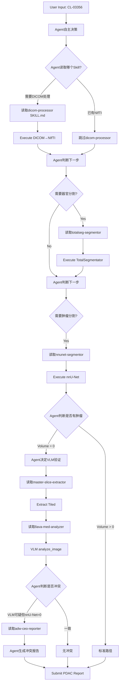

# ChangHai PDA Agent - 架构文档

## 版本信息
- **Version**: 1.0.0
- **Architecture**: Deep Agents Flat Architecture
- **Date**: 2026-03-24
- **Main Entry**: `interactive_main.py`

---

## 架构哲学

### 核心设计原则

1. **单一Agent扁平化**: 无Subagents，所有逻辑由主Agent直接处理
2. **Skills驱动模块化**: 原子化能力单元，按需加载执行
3. **证据主权**: 严禁编造测量数据，所有结果必须物理可追溯
4. **认知失调监测**: 自主检测模型间冲突，无需金标准

### 与TianTan项目的架构继承

ChangHai_PDA继承TianTan_Brain_Metastases_Agent的Deep Agents架构模式：

| 组件 | TianTan | ChangHai_PDA |
|------|---------|--------------|
| 架构模式 | 单一Agent扁平化 | 单一Agent扁平化 ✅ |
| Skills系统 | 4个挂载 | 7个挂载 |
| Tools | execute/read_file/analyze_image/submit | 相同 |
| Backend | CompositeBackend | CompositeBackend ✅ |
| 证据验证 | 引用审计 | 引用审计 ✅ |
| 创新点 | 治疗线判定 | 认知失调监测 |

---

## 目录结构

```
/media/luzhenyang/project/ChangHai_PDA/
│
├── interactive_main.py          # 主控Agent入口
├── CLAUDE.md                    # 项目配置文档
├── ARCHITECTURE.md              # 本文档
│
├── skills/                       # Skills目录
│   ├── dicom_processor/         # DICOM→NIfTI转换
│   │   ├── SKILL.md             # Skill协议文档
│   │   └── scripts/             # 执行脚本
│   │       ├── dicom_to_nifti.py
│   │       ├── resample_isotropic.py
│   │       └── extract_metadata.py
│   │
│   ├── totalseg_segmentor/      # 器官分割
│   │   ├── SKILL.md
│   │   └── scripts/
│   │       ├── run_totalseg.py
│   │       ├── verify_segmentation.py
│   │       └── analyze_pancreas.py
│   │
│   ├── nnunet_segmentor/        # 肿瘤分割
│   │   ├── SKILL.md
│   │   └── scripts/
│   │       ├── run_nnunet.py
│   │       ├── analyze_tumor.py
│   │       └── extract_tumor_mask.py
│   │
│   ├── master_slice_extractor/  # 多窗位切片
│   │   ├── SKILL.md
│   │   └── scripts/
│   │       └── extract_tiled_master_slice.py
│   │
│   ├── llava_med_analyzer/      # VLM视觉分析
│   │   ├── SKILL.md
│   │   └── scripts/
│   │       └── parse_suspicion.py
│   │
│   ├── adw_ceo_reporter/        # CEO冲突检测
│   │   ├── SKILL.md
│   │   └── scripts/
│   │       ├── detect_conflict.py
│   │       ├── root_cause_analysis.py
│   │       └── generate_ceo_report.py
│   │
│   └── vascular_topology/       # 血管拓扑（可选）
│       ├── SKILL.md
│       └── scripts/
│
├── utils/                        # 工具模块
│   └── llm_factory.py           # LLM/VLM客户端工厂
│
├── workspace/                    # Sandbox工作目录
│   ├── sandbox/                 # Agent隔离文件系统
│   │   ├── patients/           # 患者工作区
│   │   ├── execution_logs/     # 执行历史日志
│   │   └── memories/           # 持久化记忆
│   │       ├── personas/       # 患者画像
│   │       └── principles/     # 临床原则
│   └── skills/                 # Skill备份
│
├── data/                         # 数据目录（原有）
│   ├── raw/dicom/              # DICOM原始数据
│   ├── processed/nifti/        # NIfTI处理结果
│   ├── processed/segmentations/# 分割结果
│   └── results/                # 最终结果
│
└── data/scripts/                 # 原有脚本（保留）
```

---

## Skills详细设计

### Skill 1: dicom-processor

**Purpose**: DICOM to NIfTI conversion with spatial standardization

**Agent Decision**: Agent decides if DICOM processing is needed based on patient data availability

**Key Output**:
- `{PATIENT_ID}_CT_1mm.nii.gz` (1.0mm³ isotropic)
- `metadata.json`

**Critical**: Spatial standardization ensures TotalSegmentator and nnU-Net operate on same coordinate system

---

### Skill 2: totalseg-segmentor

**Purpose**: TotalSegmentator organ and vessel segmentation

**Agent Decision**: Agent decides if organ segmentation is needed based on clinical context

**Key Output**:
- `pancreas.nii.gz` (max area slice Z)
- `superior_mesenteric_vein.nii.gz`
- `pancreas_analysis.json`

**Critical**: Provides Z=145 for master slice extraction

---

### Skill 3: nnunet-segmentor

**Purpose**: nnU-Net v1 tumor segmentation (MSD Task07)

**Agent Decision**: Agent always considers tumor segmentation, but interprets results with clinical judgment

**Key Output**:
- `{PATIENT_ID}.nii.gz` (3-class: 0/1/2)
- `true_tumor_mask.nii.gz` (binary)
- `tumor_analysis.json`

**Warning**: May produce FALSE NEGATIVES (0ml) for isodense tumors. Agent uses semantic judgment to detect these.

---

### Skill 4: master-slice-extractor

**Purpose**: Extract multi-window Tiled master slice

**Agent Decision**: Agent decides if multi-window extraction is needed based on nnU-Net results and clinical context

**Key Output**:
- `{PATIENT_ID}_master_slice_tiled.png` (1536×512)
- Three windows: Standard/Narrow/Soft

**Critical**: Narrow window (W:150) enhances isodense contrast by 2.7x

**Implementation**: HU transformation: `windowed = (raw_hu - center) / width * 255 + 128`

---

### Skill 5: llava-med-analyzer

**Purpose**: LLaVA-Med VLM analysis for PDAC detection

**Agent Decision**: Agent decides if VLM analysis is needed based on prior results

**Key Output**:
- Semantic assessment (Agent's judgment)
- VLM findings description
- `{PATIENT_ID}_vlm_assessment.json`

**Critical**: Agent uses semantic understanding, NOT hard-coded scores, for conflict detection

---

### Skill 6: adw-ceo-reporter

**Purpose**: Endogenous conflict detection and CEO decision

**Agent Decision**: Agent decides if conflict analysis is needed by comparing nnU-Net and VLM results

**Key Output**:
- Conflict detection (Agent's judgment)
- Root cause analysis
- CEO report (Markdown)

**Algorithm**: Agent applies clinical reasoning:
```
IF (nnU-Net: "no tumor") AND (VLM: "suspicious morphology")
THEN Agent judges: ENDOGENOUS_FALSE_NEGATIVE
ACTION: ESCALATE_TO_RADIOLOGIST
```

**No hard-coded thresholds. Agent's semantic understanding IS the detection mechanism.**

---

### Skill 7: vascular-topology (Optional)

**Purpose**: Vascular topology for resectability assessment

**Agent Decision**: Agent decides if vascular assessment is needed based on tumor detection and surgical consideration

**Key Output**:
- Vascular assessment JSON
- Resectability classification
- Vascular overlay image

---

## 执行流程 (Agent自主决策)



**关键原则**: Agent自己决定读取哪个Skill、执行什么命令、判断是否冲突。没有预编码workflow。

---

## 引用验证机制

### Citation Formats

1. **Measurement Evidence**:
   - `[Script: dicom_to_nifti.py, Output: Spacing 1.0mm³]`
   - `[Script: analyze_tumor.py, Output: Volume 0ml]`

2. **Image Evidence**:
   - `[Local: CL-03356_master_slice_tiled.png, Visual: Z145]`

3. **Segmentation Evidence**:
   - `[Tool: nnU-Net, Volume: 0ml, Labels: [0,1]]`

4. **VLM Evidence**:
   - `[Tool: LLaVA-Med, Assessment: {Agent's semantic judgment}]`
   - `[Agent: Conflict_Detected, Reasoning: {clinical rationale}]`

### Validation Rules

- All `[Script: ...]` citations must appear in execution audit log
- All `[Local: ...]` citations must have corresponding file reads
- All `[Tool: ...]` citations must have tool call records

---

## 与原有代码的关系

### 保留的代码

原有的 `/data/scripts/` 目录中的脚本全部保留：
- `dicom_to_nifti.py`
- `run_nnunet_cl03356.py`
- `extract_master_slice.py`
- `adw_ceo_report.py`
- ...etc

这些脚本被迁移到对应的 Skill `scripts/` 目录下，或通过 `execute` 工具调用。

### 新增代码

1. `interactive_main.py` - 主控Agent
2. `skills/*/SKILL.md` - Skill协议文档
3. `skills/*/scripts/*.py` - Skill执行脚本
4. `utils/llm_factory.py` - LLM/VLM客户端

---

## 部署说明

### 环境变量设置

```bash
# Model APIs
export OPENROUTER_API_KEY="your-key"
export DASHSCOPE_API_KEY="your-key"

# nnU-Net paths
export nnUNet_raw_data_base=".../data/models/nnunet/..."
export nnUNet_preprocessed="..."
export RESULTS_FOLDER="..."

# Sandbox
export SANDBOX_ROOT="/media/luzhenyang/project/ChangHai_PDA/workspace/sandbox"
```

### 启动命令

```bash
# Activate environment
conda activate ChangHai

# Install dependencies
pip install deepagents langgraph langchain-openai

# Run agent
python interactive_main.py
```

---

## 未来扩展

### 可能的增强

1. **Additional Skills**:
   - `survival_predictor` - Survival analysis
   - `treatment_recommender` - Treatment recommendation
   - `report_generator` - Automated report generation

2. **Subagents** (if needed later):
   - Research subagent for literature search
   - Visualization subagent for figure generation

3. **Integrations**:
   - Hospital PACS integration
   - EMR data retrieval
   - Real-time monitoring

---

## 参考文档

- [Deep Agents Documentation](https://docs.langchain.com/deepagents)
- [Agent Skills Specification](https://agentskills.io/specification)
- [TianTan Project](file:///media/luzhenyang/project/TianTan_Brain_Metastases_Agent)
