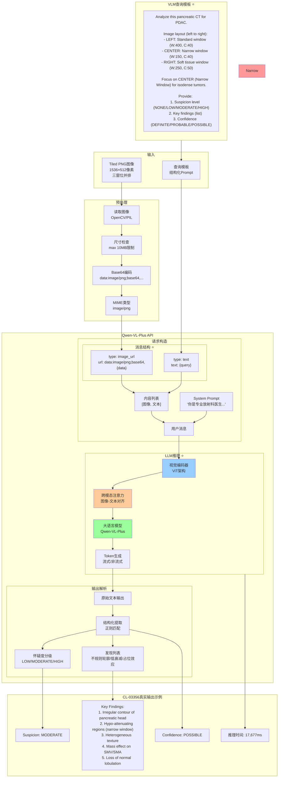
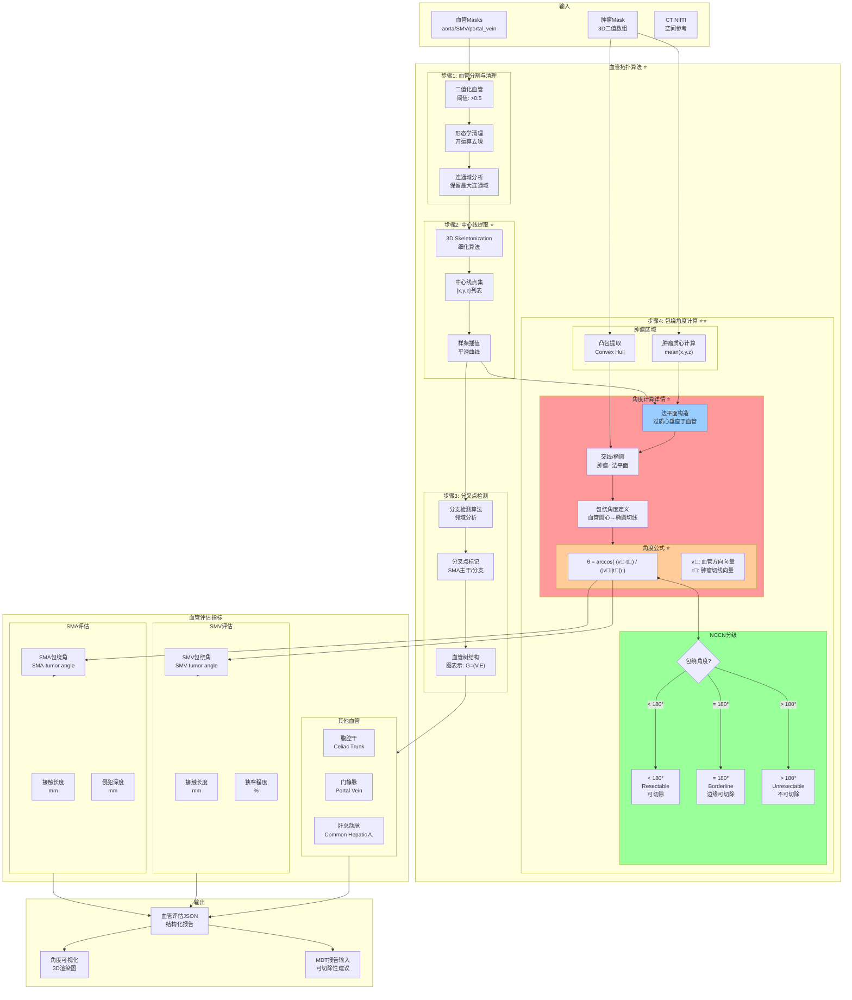
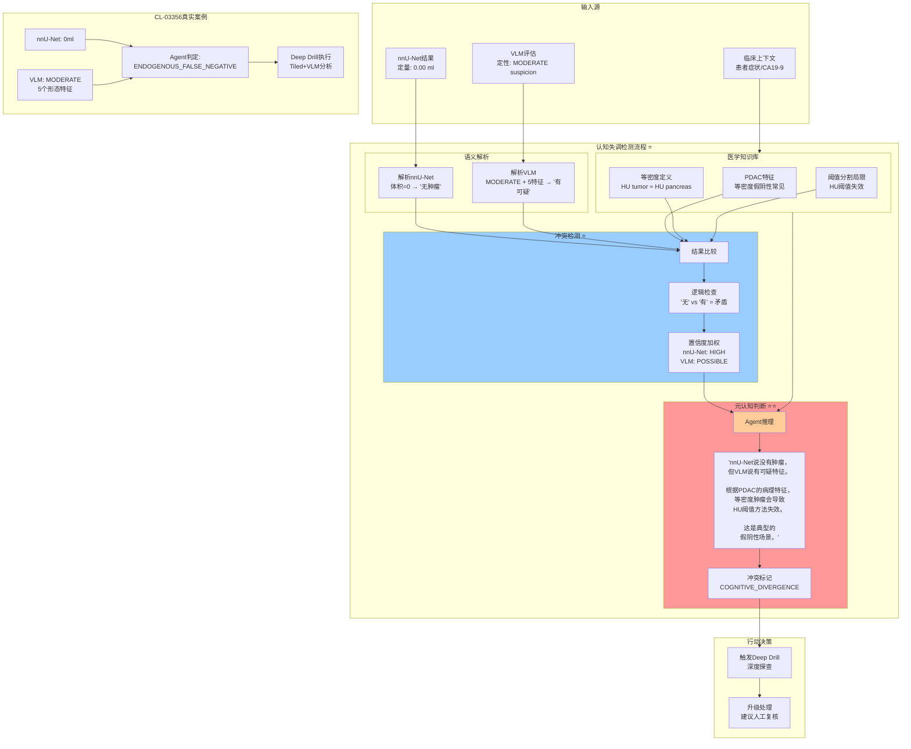
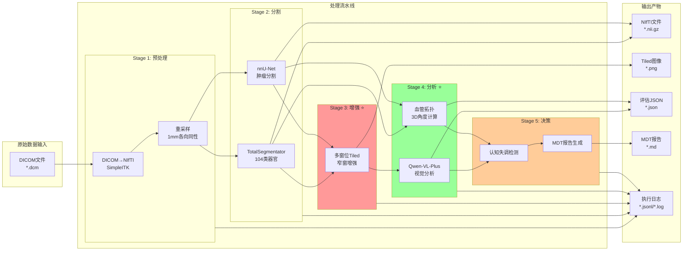

# ChangHai PDAC Agent 技术架构详解 (Mermaid图表)

## 一、系统整体架构流程图

```mermaid
flowchart TB
    subgraph Input["📥 输入层"]
        PatientID["患者ID: CL-03356"]
        DICOM["DICOM序列<br/>CT静脉期增强扫描"]
    end

    subgraph AgentCore["🧠 Agent核心决策层"]
        direction TB
        EnvAware["环境感知<br/>发现已有数据"]
        Decision1{"nnU-Net结果?"}
        NormalFlow["常规流程"]
        DeepDrillTrigger["🚨 触发Deep Drill"]
    end

    subgraph SkillsLayer["🔧 SKILL执行层"]
        direction TB

        subgraph DicomSkill["SKILL: DICOM处理器"]
            DicomConvert["DICOM → NIfTI转换<br/>SimpleITK读取DICOM序列<br/>Spacing/Origin/方向保留"]
        end

        subgraph TotalSegSkill["SKILL: TotalSegmentator分割"]
            TotalSeg["多器官分割<br/>104类解剖结构<br/>包括:胰腺/血管/器官"]
            PancreasMask["胰腺Mask提取<br/>Label: pancreas"]
            VesselMasks["血管Masks<br/>aorta/portal_vein/splenic_vein"]
        end

        subgraph NnunetSkill["SKILL: nnU-Net肿瘤分割"]
            Nnunet["3D U-Net推理<br/>MSD Task07预训练权重"]
            TumorMask["肿瘤Mask<br/>Label 2 = 肿瘤"]
            VolumeCalc["体积计算<br/>voxel_count × voxel_volume"]
        end

        subgraph TiledSkill["SKILL: 多窗位Tiled切片 ⭐"]
            direction TB
            MaxAreaSlice["最大面积切片定位<br/>argmax(胰腺mask面积)"]
            WindowTransform["HU值窗位变换 ⭐"]
            ThreeWindow["三窗位生成"]
            TiledConcat["水平拼接<br/>1536×512 PNG"]
        end

        subgraph VLMSkill["SKILL: VLM视觉分析 ⭐"]
            Base64Encode["Base64图像编码"]
            QwenVL["Qwen-VL-Plus API调用"]
            VLMReasoning["视觉推理<br/>不规则轮廓/低衰减/占位效应"]
            SuspicionScore["怀疑度评估<br/>LOW/MODERATE/HIGH"]
        end

        subgraph VascularSkill["SKILL: 血管拓扑评估 ⭐"]
            direction TB
            CenterlineExtract["血管中心线提取<br/>3D Skeletonization"]
            BifurcationDetect["分叉点检测<br/>SMA/SMV分支识别"]
            AngleCalc["包绕角度计算 ⭐<br/>肿瘤质心→血管切线平面"]
            Resectability["可切除性分级<br/>NCCN标准"]
        end
    end

    subgraph CognitiveLayer["🧩 认知失调检测层"]
        Compare["结果比较"]
        Dissonance{"存在冲突?"]
        EndogenousFN["ENDOGENOUS_FALSE_NEGATIVE<br/>等密度假阴性检测"]
    end

    subgraph Output["📤 输出层"]
        MDTReport["MDT报告<br/>引用验证审计"]
        Warning["⚠️ 需人工复核标记"]
    end

    %% 流程连接
    PatientID --> EnvAware
    DICOM --> DicomConvert

    EnvAware --> TotalSeg
    TotalSeg --> PancreasMask
    TotalSeg --> VesselMasks

    EnvAware --> Nnunet
    Nnunet --> TumorMask
    TumorMask --> VolumeCalc

    VolumeCalc --> Decision1
    Decision1 -->|Volume > 0| NormalFlow
    Decision1 -->|Volume = 0| DeepDrillTrigger

    DeepDrillTrigger --> MaxAreaSlice
    PancreasMask --> MaxAreaSlice

    MaxAreaSlice --> WindowTransform
    WindowTransform --> ThreeWindow
    ThreeWindow --> TiledConcat

    TiledConcat --> Base64Encode
    Base64Encode --> QwenVL
    QwenVL --> VLMReasoning
    VLMReasoning --> SuspicionScore

    TumorMask --> CenterlineExtract
    VesselMasks --> CenterlineExtract
    CenterlineExtract --> BifurcationDetect
    BifurcationDetect --> AngleCalc
    AngleCalc --> Resectability

    VolumeCalc --> Compare
    SuspicionScore --> Compare
    Compare --> Dissonance
    Dissonance -->|Yes| EndogenousFN

    NormalFlow --> MDTReport
    EndogenousFN --> Warning
    Warning --> MDTReport
    Resectability --> MDTReport

    style DeepDrillTrigger fill:#ff9999
    style EndogenousFN fill:#ffcc99
    style TiledSkill fill:#99ccff
    style VLMSkill fill:#99ff99
    style VascularSkill fill:#ffccff
```

---

## 二、SKILL: 多窗位Tiled切片 - 技术实现详解

```mermaid
flowchart LR
    subgraph InputTiled["输入"]
        CTNifti["CT NIfTI<br/>Shape: (512,512,194)<br/>Spacing: (1,1,1)mm"]
        PancreasNifti["胰腺Mask NIfTI<br/>Binary: 0/1"]
    end

    subgraph CoreAlgorithm["核心算法 ⭐"]
        direction TB

        subgraph Step1["步骤1: 最大面积切片定位"]
            SliceLoop["遍历所有Z轴切片<br/>for z in range(depth)"]
            AreaCalc["计算胰腺面积<br/>area = np.sum(mask[:,:,z])"]
            ArgMax["取最大面积索引<br/>z_max = argmax(area)"]
        end

        subgraph Step2["步骤2: HU值窗位变换 ⭐"]
            RawHU["原始HU值<br/>范围: [-1000, +1000]"]
            WindowFormula["窗位公式 ⭐<br/>windowed = (HU - C) / W × 255 + 128"]
            Clip["截断到[0,255]<br/>np.clip(windowed, 0, 255)"]
            UInt8["转换为uint8<br/>8位灰度图像"]
        end

        subgraph Step3["步骤3: 三窗位并行生成"]
            direction LR

            subgraph Standard["标准窗"]
                StdParam["W:400, C:40"]
                StdRange["HU范围: [-160, 240]<br/>跨度: 400 HU"]
                StdImg["512×512图像"]
            end

            subgraph Narrow["窄窗 ⭐"]
                NarrowParam["W:150, C:40"]
                NarrowRange["HU范围: [-35, 115]<br/>跨度: 150 HU"]
                NarrowImg["512×512图像"]
            end

            subgraph Soft["软组织窗"]
                SoftParam["W:250, C:50"]
                SoftRange["HU范围: [-75, 175]<br/>跨度: 250 HU"]
                SoftImg["512×512图像"]
            end
        end

        subgraph Step4["步骤4: Tiled拼接"]
            HConcat["水平拼接<br/>np.concatenate([std, narrow, soft], axis=1)"]
            OutputShape["输出形状<br/>(512, 1536, 3)"]
            SavePNG["保存为PNG<br/>无损压缩"]
        end
    end

    subgraph Physics["物理原理 ⭐"]
        direction TB
        NormalPancreas["正常胰腺<br/>HU: 40-60"]
        PDACTumor["PDAC肿瘤<br/>HU: 35-50<br/>(纤维化)"]
        Diff["差异: ~10 HU"]

        StandardContrast["标准窗对比度<br/>10/400 = 2.5%"]
        NarrowContrast["窄窗对比度 ⭐<br/>10/150 = 6.7%<br/>增强2.6倍"]
    end

    %% 连接
    CTNifti --> SliceLoop
    PancreasNifti --> SliceLoop
    SliceLoop --> AreaCalc --> ArgMax

    ArgMax --> RawHU
    RawHU --> WindowFormula --> Clip --> UInt8

    UInt8 --> StdParam
    UInt8 --> NarrowParam
    UInt8 --> SoftParam

    StdParam --> StdRange --> StdImg
    NarrowParam --> NarrowRange --> NarrowImg
    SoftParam --> SoftRange --> SoftImg

    StdImg --> HConcat
    NarrowImg --> HConcat
    SoftImg --> HConcat
    HConcat --> OutputShape --> SavePNG

    NormalPancreas --> Diff
    PDACTumor --> Diff
    Diff --> StandardContrast
    Diff --> NarrowContrast

    style Narrow fill:#ff9999
    style NarrowParam fill:#ff9999
    style NarrowContrast fill:#ff9999
    style WindowFormula fill:#ffcc99
```



---

## 三、SKILL: VLM视觉分析 - 技术实现详解



---

## 四、SKILL: 血管拓扑评估 - 技术实现详解



---

## 五、认知失调检测机制



---

## 六、系统数据流全景图



---

## 使用说明

以上Mermaid图表可以在以下平台渲染：

1. **GitHub/GitLab**: 直接嵌入Markdown，自动渲染
2. **Notion**: 使用Mermaid代码块
3. **Obsidian**: 安装Mermaid插件
4. **VS Code**: 安装Markdown Preview Mermaid Support插件
5. **在线编辑器**: https://mermaid.live

### 渲染技巧

- 使用`subgraph`组织相关节点
- 使用`style`突出显示关键技术点
- 使用`⭐`标记创新点
- 使用不同颜色区分不同类型的SKILL

### 颜色说明

| 颜色 | 含义 |
|------|------|
| 🟥 #ff9999 | 关键创新点/核心算法 |
| 🟧 #ffcc99 | 重要步骤/公式 |
| 🟦 #99ccff | 输入/数据流 |
| 🟩 #99ff99 | 输出/结果 |
| 🟪 #ffccff | 决策点/判断逻辑 |
