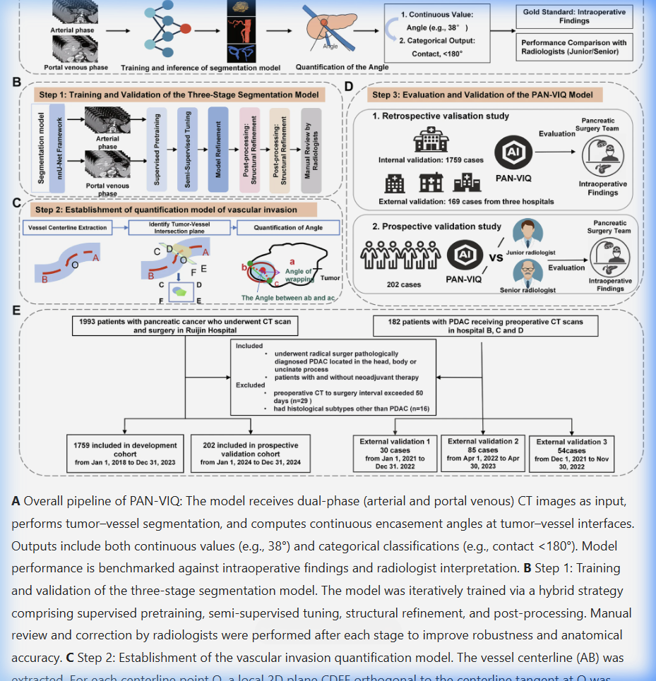
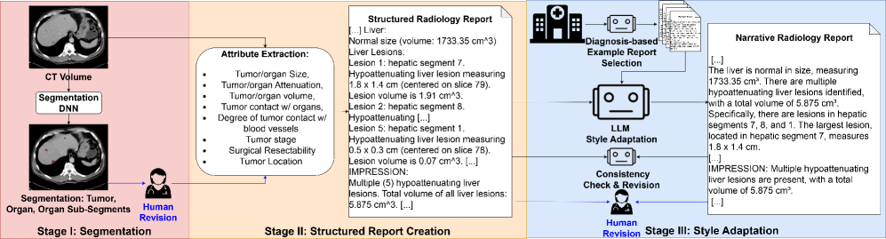
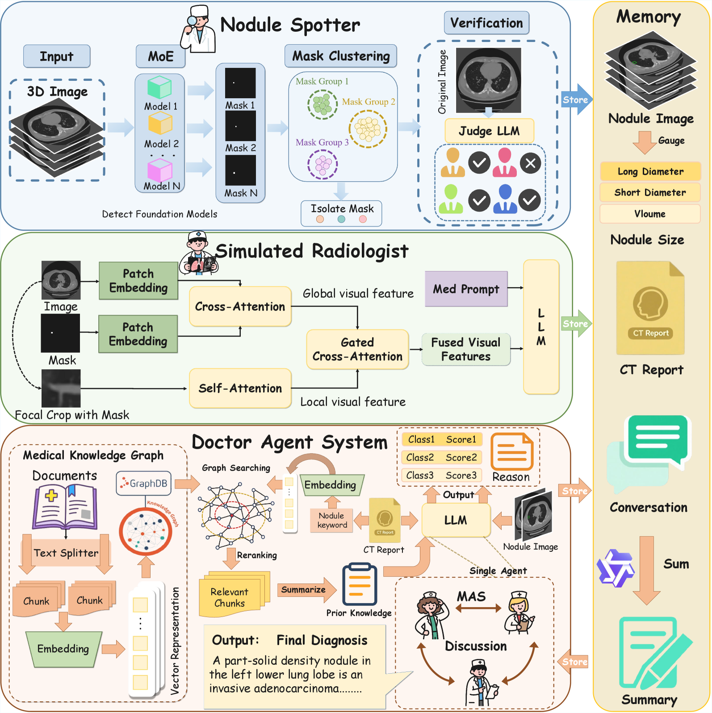
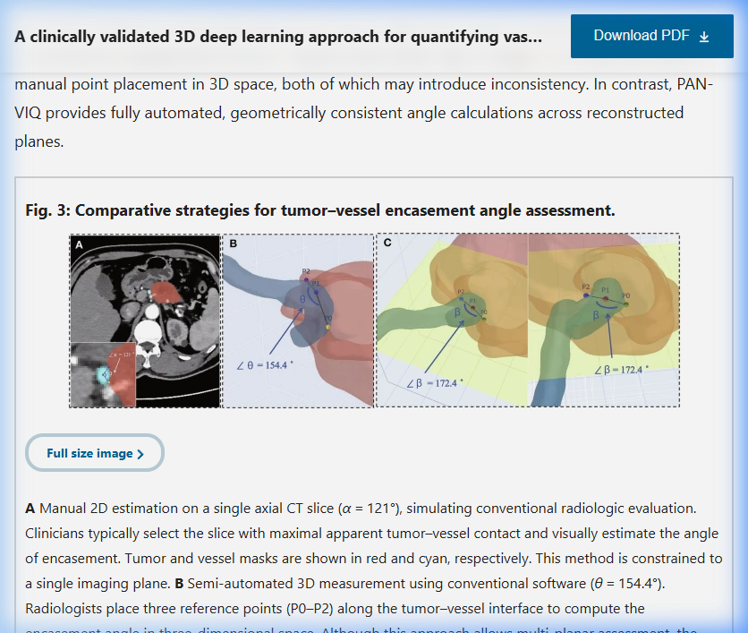

# 初始方案 (PancreasMDT v1.0)

## 临床叙事 (Clinical Narrative)
*   **痛点 A：破解“等密度陷阱” (The Invisible Tumor)**：针对 10% 无法被常规分割模型识别的等密度 PDAC，建立基于 Agent 视觉感知与几何推理的补位机制，构建“认知安全网”。
*   **痛点 B：终结“拟态迷宫” (The Mimic Trap)**：胰腺炎 (AP/CP) 与肿瘤 (PDAC/pNET) 在影像上极易混淆，通过全病谱精标数据驱动的 MDT 专家舰队，实现从“图像分类”到“临床决策”的跨越。

## AI 技术创新点 (Technical Innovations)

1.  **主动感知的正交巡航 (Active Topological MPR Cruise)**：
    - 既往的Agent主要是2D层面（PathAgent）或者固定Pipeline上进行智能体的“探查“，本工作拟改变 3D 固定空间输入的思维，由智能体动态控制采样平面 (MPR) 沿着血管/胰管中心线进行“剥洋葱”式的主动探查（胰腺中心线依赖器官级的分割，血管中心线依赖血管级的分割，血管级可行性参考PAN-VIQ）。
    
    - 重要性：1）在多种胰腺疾病诊断目标下，只有能在空间拓扑层面让Agent自由“探查”，才可能满足各种疾病特异性的检查，同时为等密度胰腺分割失败提供fallback；2）胰腺癌中（发病率较高的PDAC），血管包绕角的判断直接决定了是否能手术的重要决策。
    
    - **创新性：最新的PAN-VIQ，是在血管中进行固定“路由”，无回退策略，前提必须是血管精准分割无误，而本工作，针对更多胰腺疾病类别，可以在胰腺器官/关键血管层面进行智能体得自主巡游，如果分割失败，仍有fallback策略，充分利用Harness系统，尽最大可能准确诊断疾病。
    
2.  **具备治理能力的 Agent Harness (Governed Reasoning Loop)**：
    - 引入“针对胰腺疾病的多智能体Harness”系统。对于多类别/多分型数据，需要融入多智能体编排规划，不同的专家Agent（如PDAC，NET具有不同的关注点，背景知识，工具等）。当分割结果与 VLM 视觉发现存在冲突时（等密度PDAC），触发自动纠偏也需要Harness的支撑。
    
    - 重要性：如果没有Agent Harness层面的支持，1）不同专家智能体缺少“智能“规划，会退化回以往工作的”固定workflow“，2）缺乏回退机制，一旦遇到关键的PDAC无法分割血管或者肿瘤，无法从间接征象以及于其它疾病的鉴别中得到判断，3）不同的胰腺疾病具有不同的关注点，对分割结果的依赖程度不同，需要灵活赋予”背景知识“在必要的时候召唤sub-agents进行鉴别诊断。
    
    - **创新性：临床胰腺Agent，目前尚未有智能体编排，memory，自进化、harness等概念的Agent工作出现在胰腺疾病。
    
3.  **全病谱诊断流形对齐 (Cross-Pathology Manifold Alignment)**：
    - 建立统一的胰腺影像诊断流形，将 AP, CP, PDAC, NET 等 8 类病变映射至同一语义空间，实现多病种的稳健鉴别诊断。也就是通过对比学习这类方法（可能要先挖掘“难样本”），能够把多种疾病在特征空间区分开。
    - ——主要关注高度依赖血管分割的PDAC和CP设计：1）PDAC vs. CP，2）PDAC（严重血管包绕） vs. PDAC（无受侵）/ Normal。
    
    - 重要性：等密度肿瘤无法分割的时候，可能出现假阴性，或者病理特征不明显可能会出现误诊，需要在特征空间对疾病（分型）进行判断。
    
    - **创新性：以往的工作遇到无法分割或者鉴别诊断困难的时候，主要依赖于直接”匹配文本描述的间接征象在CT（Slice）图像上是否存在“，本创新点是在”疾病特征的语义层面“进行判断。
    
    注意：肿瘤和血管任一方无法分割都会造成巨大阻碍，现有的工作，如PAN-VIQ就难以处理等密度的情况，但是各个工作都“叠甲”了，比如退而用指南中的间接征象，用文本的报告补充等。

---

# 胰腺癌/医学影像多智能体文献精读矩阵 (Literature Review Matrix)

此文档用于严谨沉淀我们所调研的高水平论文。在确定 PancreasMDT 的最终 Standing Point 之前，我们依据“Clinical Pain Point (临床痛点)”与“Knowledge Gap (知识空白/研究间隙)”进行横向比对，确保我们的创新直击痛点。

| 方法 / 论文             | 核心创新点                                    |                   框架图 (Arch)                   | Wiki 精读                                     | 备注            |     |     |
| :------------------ | :--------------------------------------- | :--------------------------------------------: | :------------------------------------------ | :------------ | --- | --- |
| **PAN-VIQ**         | 3D encasement angle 测算 (Ruijin Hospital) |            | [Wiki Doc](research/res_PAN-VIQ.md)         | **我们的基准指标**   |     |     |
| **PathAgent**       | Navigator/Perceptor/Executor 巡航架构        |        | [Wiki Doc](research/res_PathAgent.md)       | 启发 MPR 巡航逻辑   |     |     |
| **MedAgent-Pro**    | 医疗多智能体分层协商                               |  | [Wiki Doc](research/res_MedAgent-Pro.md)    | MDT 圆桌机制参考    |     |     |
| **MEREDITH**        | 证据链支撑的可靠推理                               |                     (待提取)                      | [Wiki Doc](research/res_MEREDITH.md)        | 推理可解释性        |     |     |
| **RadGPT**          | 等密度肿瘤检测 (82% 基准)                         |              | [Wiki Doc](sources/RadGPT-ICCV2025.md)      | 性能对标          |     |     |
| **LungNoduleAgent** | Focal Prompting + Gated Cross-Attention  |       | [Wiki Doc](research/res_LungNoduleAgent.md) | **视觉-文本对齐参考** |     |     |

---

| 发表年份 | 类别                     | 论文/作者/单位                                                                                                                                       | 架构图                                                                                            | 临床痛点                              | Clinical Gap                       | Technical Gap                             | 核心创新点                                                                                                                          | 技术细节                                                                                                                                                                                                                                                                                                                                          | 数据集/临床验证                                                                 | 对我们项目的启示                                                                             |
| :--- | :--------------------- | :--------------------------------------------------------------------------------------------------------------------------------------------- | :--------------------------------------------------------------------------------------------- | :-------------------------------- | :--------------------------------- | :---------------------------------------- | :----------------------------------------------------------------------------------------------------------------------------- | :-------------------------------------------------------------------------------------------------------------------------------------------------------------------------------------------------------------------------------------------------------------------------------------------------------------------------------------------- | :----------------------------------------------------------------------- | :----------------------------------------------------------------------------------- |
| 2025 | **Geometric Pipeline** | **PAN-VIQ**   SJTU-Ruijin-UIH   [Wiki Doc](research/res_PAN-VIQ.md)   [GitHub](https://github.com/IMIT-PMCL/PDAC)                     |   | 胰腺癌血管侵犯定量评估缺乏标准化，Kappa 0.28-0.55。 | 放射科医生对包绕角的主观 2D 判读差异大。             | 纯几何管线，分割失败时无降级推理策略。                       | **3D 连续血管包绕角自动定量框架** —— 首个临床验证的血管-肿瘤交互测算系统。 | **Seg**: 基于 2,130 例 CT 的双期 nnU-Net 分割; **Quant**: 3D 几何模块，通过血管骨架、法平面重采样与余弦定理∠bac计算实时包绕角。 | 2,130 例私有 (瑞金) 4院; 202 前瞻验证; CHA: 模型 90.22% vs 放射科。 | 🔴 **指标基准**: 定义了 3D 测算的黄金指标，但暴露了“分割失效”时的灾难性风险（无降级能力）。 |
| 2023 | **Segmentation Tool**  | **TotalSegmentator v2**   [GitHub](https://github.com/wasserth/TotalSegmentator)                                                            | -                                                                                              | 通用全身 CT 分割。                       | -                                  | **❌ 不支持 SMA/CA/CHA/SMV** 单独分割。            | 117 类解剖结构分割。                                                                                                                   | 权重 ✅ `pip install TotalSegmentator`。                                                                                                                                                                                                                                                                                                          | 1,204 CT。                                                                | 仅做**粗定位基座**。Claude Code 侧不要尝试用它做 SMA 分割。                                             |
| 2024 | **Dataset**            | **PanTS Dataset**   JHU MrGiovanni   [Wiki Doc](entities/PanTS.md)   [GitHub](https://github.com/MrGiovanni/PanTS)                    | -                                                                                              | 胰腺肿瘤/血管分割 benchmark。              | -                                  | -                                         | **36,390 CT** 大规模数据集。                                                                                                          | **[Claude Code 语义审计 - 2026-04-20]**: **✅ 实证通过**。Label 27 (Veins) Z 轴跨度 200mm，物理覆盖 PV 和 SMV 完整系统；Label 5 (Celiac) 检测到三叉结构 (degree=3)，完整包含 CHA。                                                                                                                                                                                                 | tr:9000, te:901; HF 镜像可加速。                                               | 🟢 **P0 级核心数据源**。血管标注在物理上 100% 完备，无需额外补充。建议：直接利用骨架化 Junction 点对合并类进行自动拆解。            |
| 2025 | **Dataset**            | **AbdomenAtlas 3.0**   [Wiki Doc](entities/AbdomenAtlas-3.0.md)   [HuggingFace](https://huggingface.co/AbdomenAtlas)                     | -                                                                                              | 大规模腹部 CT 标注。                      | -                                  | -                                         | 首个公开逐体素胰周血管标注。                                                                                                                 | **[Claude Code 实审粒度]**: 粒度较细，包含 celiac_trunk(Label 44)✅, SMA(Label 54)✅, 整体静脉 veins(Label 55)✅。❌ 同样缺失独立的 CHA (肝总动脉)。                                                                                                                                                                                                                          | download_atlas_3.sh 分块下载。                                                | 🟢 **P0 级训练数据**。血管覆盖度优于 PanTS，可用脚本拆分静脉系。                                             |
| 2025 | **Source Summary**     | **RadGPT (ICCV 2025)**   [Wiki Doc](sources/RadGPT-ICCV2025.md)                                                                             |                                                         | 3D 影像-文本报告配对。                     | 缺乏 3D 掩模与叙述性报告配对。                  | 等密度肿瘤分割敏感性 82% (仍有提升空间)。                  | **结构化影像语料库构建 Agent (RadGPT)** —— 首次实现 3D 空间、Mask 与叙述性报告的自动配对。 | **Pipeline**: Segment → Extract → Transform 三阶段自动化构建 3D 影像-文本配对数据集。 | 构建了 AbdomenAtlas 3.0 (9,000+ 扫描)。 | 🟢 **基准意义**: 提供了全球首个等密度胰腺癌检测的高质量基准数据流。 |
| 2023 | **Detection Tool**     | **PANDA (Nature Medicine)**   [Wiki Doc](entities/PANDA.md)   [Nature Medicine 2023](https://www.nature.com/articles/s41591-023-02640-w) |                                                           | 非增强 CT (NCCT) 下胰腺癌的早期筛查。          | 放射科医生在 NCCT 上漏诊率极高，等密度病灶几乎不可见。     | 缺乏对血管受累的定量物理推理。                           | **三阶段框架 (nnU-Net 基座 + 记忆 Transformer 网络)**。                                                                                    | **Stage 1**: 胰腺分割定位; **Stage 2**: 多任务学习 (Seg+Det), 损失函数 $L = Dice + \alpha Cls$; **Stage 3**: **Dual-path Memory Transformer**, 利用 200 个可学习 Memory Tokens 提取微观纹理。利用 CECT 掩膜配准至 NCCT 生成伪标签进行监督训练。                                                                                                                                              | 41,206 例多中心验证 (长海、瑞金等)。                                                  | 🟢 **等密度检测标杆**: 证明了微观纹理对 8 类疾病分类的可行性。其“借用增强期标签”训练非增强期的思路可迁移。                         |
| 2025 | **Agent System**       | **LungNoduleAgent**   HangZhou Dianzi Univ.   [Wiki Doc](research/res_LungNoduleAgent.md)                                                |                                       | 放射医师对肺结节性状评价存在主观性。                | 肺结节一致性(Kappa=0.60-0.75)已较高，痛点在于费时。 | VLM 全局感测在局部高维特征上产生“视觉颗粒化”丢失；缺乏显式几何边界对齐机制。 | **1) 临床工作流仿真 (Spotter→SR→DAS)**; **2) Focal Prompting 机制**; **3) Medical Graph RAG 推理**; **4) Judge-then-Decide 模式**。 | **Perc**: Focal Prompting 锁定局部形态学并保留跨切片解析度；**Exec**: 基于权威医学知识图谱的 RAG 策略实现循证推理；**Consensus**: 5 智能体讨论与评审委员会机制，对抗模型幻觉。                                                                                                                                                                                                                          | LIDC-IDRI (1018扫描); Private (1616+386)。                                  | 🔴 **超越点**: 它的 2D Gated 融合极具启发，但刻意回避了 3D 拓扑。我们的突破口是 **Volume-Topology Agent**。       |
| 2025 | **Agent System**       | **PathAgent**   [Wiki Doc](research/res_PathAgent.md)   [arXiv:2511.17052](https://arxiv.org/abs/2511.17052)                             |                                                   | WSI 病理诊断的可解释性。                    | 传统 WSI AI 输出“黑盒”预测。                | 缺乏 Agent 自主巡航、逐步推理的能力。                    | **首个免训练交互式病理 Agent** —— 模拟病理医师“放大、移动、自纠偏”的交互式探测逻辑。 | **Architecture**: Navigator(寻址)+Perceptor(翻译)+Executor(推理)三阶段闭环。利用大模型直接在百万像素空间驱动“放大”与“寻址”。 | 5 标杆数据集 Zero-shot; 与人类专家协同评估。 | 🟢 **巡航范式**: 确立了 Agent 如何通过“视口控制”在海量 3D/2D 空间寻找证据点。 |
| 2025 | **Agent System**       | **MedAgent-Pro**   [Wiki Doc](research/res_MedAgent-Pro.md)   [ICLR 2025](https://arxiv.org/abs/2503.18968)                              |                                             | 复杂多模态医学诊断。                        | 单一 LLM 无法兼顾指南遵循与个体化分析。             | 缺乏分层推理: Disease-level vs Patient-level。   | **分层推理工作流 (Hierarchical Paradigm)** —— 按疾病查指南 (RAG) 再按个体影像分析的双层诊断模式。 | **Workflow**: 整合医学知识图谱的推理 Agent，通过“循证检索-个体映射-纠偏协作”完成诊断。 | MedQA/PathVQA 等 4 benchmark。                                             | 🟢 **治理框架**: 奠定了 MDT 智能体“先对齐准则、再对齐病人”的协同机制。 |
| 2024 | **Agent System**       | **MEREDITH**   [Wiki Doc](research/res_MEREDITH.md)   [JCO PO 2024](https://github.com/LammertJ/MEREDITH)                                | -                                                                                              | 精准肿瘤治疗推荐耗时且依赖专家。                  | MTB 会议覆盖受限。                        | RAG 接地可提升可信度。                             | **专家引导的 MTB 决策支持 Agent** —— 首次实现基因-临床多模态数据的自动化循证推荐。 | **Mechanism**: 集成 PubMed 与 OncoKB 知识图谱的 RAG 链条，辅助 MTB 委员会生成治疗共识。 | 90 例 MTB 实测验证，与专家建议高度一致。 | 🟡 **决策闭环**: 为我们的 MDT 结论生成提供“循证闭环”样板。 |

---

## 胰腺全病谱鉴别诊断标准 (Differential Diagnosis Standards)

| 疾病 (病理) | 核心影像表现 (CT/MRI) | 诊断硬指标 (Golden Rules) | **对血管分割的依赖度** |
| :--- | :--- | :--- | :--- |
| **PDAC (癌)** | **低强化**；胰管截断 | **双管征**；远端腺体萎缩 | **极高 (P0)**：决定切除率分级 (R/BR/UR) |
| **pNET (神内)** | **动脉期显著强化** | 边界极清；实性占位 | **中**：仅用于手术路径规划 |
| **CP (慢胰)** | 实质钙化；串珠样胰管 | **“血管穿行征”**（血管穿过肿块不狭窄） | **高**：用于排除恶性侵犯 |
| **AIP (自免胰)** | **“腊肠样”**肿大；被膜影 | 胰管无扩张；IgG4 升高 | **低**：血管通常保持完整 |
| **SCN (浆液性)** | **“蜂窝样”**微囊结构 | 中央星形瘢痕/钙化 | **极低**：属良性，不侵犯血管 |
| **MCN (黏液性)** | 大囊（>2cm）；**体尾部** | 囊中囊结构；好发于中年女性 | **低**：仅监控是否压迫主要血管 |
| **IPMN (囊性)** | **与主胰管相通** | 囊实性成分/壁结节（恶变征象） | **低**：主要关注主胰管直径 |
| **SPN (实假)** | 囊实性混合；**内部出血** | 年轻女性；厚包膜；实性成分强化 | **中**：评估对邻近血管的推挤 |

## 医疗智能体分割失败防御机制 (Agent Defense Mechanisms)

| Agent 系统 | 核心防御逻辑 (应对分割失效/等密度) | 技术路径 | 局限性 |
| :--- | :--- | :--- | :--- |
| **PANDA (2023)** | **全域纹理抗性** | 通过 3D-UNet 捕捉微观灰度/间接征象 | 依赖胰腺整体分割成功 |
| **RadGPT (2025)** | **文本先验引导** | 利用历史报告描述校准模糊视觉判断 | 缺乏物理层面的再探测能力 |
| **MedAgent-Pro** | **RAG 指南回溯** | 视觉失败时强制 CoT 检索临床备选证据 | 无法生成定量物理证据 |
| **PancreasMDT (本工作)** | **几何物理 Fallback** | **正交巡航 + 血管拓扑畸变分析** | 需保持血管中心线提取精度 |
