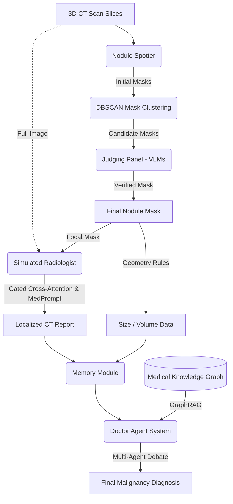

# Research: LungNoduleAgent Architecture

**Related Source**: [[../sources/source_LungNoduleAgent]]
**Domain**: Multi-Agent System, Medical AI, Computer Vision
**Date**: 2026-04-16

## 1. 核心问题与假说 (Problem & Hypothesis)
**问题**: 
1. DL 模型缺乏可解释性，临床难以信任。
2. 通用 VLM 和现存的医疗 VLM 在缺乏局部高分辨率特征引导时，面临医疗图像的“视觉颗粒度丢失 (Coarse-grained visual processing)”问题，表现低下。
3. **一致性差异背后的临床鸿沟 (The Clinical Consensus Gap)**: 
   - 肺结节 (Lung Nodule): 在 Lung-RADS 分类中，专家观察者的 Kappa 值多在 0.60–0.75 之间，2025 年 AJR 荟萃分析甚至显示合并 Kappa 高达 0.72 (doi: 10.2214/AJR.24.31682 或相近文献)，说明肺结节的难度更多在“费时漏诊”而非“高争议”。
   - 胰腺癌包绕 (Pancreatic Vascular Encasement): 由于等密度边缘模糊及复杂的 3D 拓扑结构，临床医生评估血管包绕角 (如 <180° vs >180°) 的 Kappa 值仅为 0.28–0.55 (Fair to Moderate agreement，*基于现有专科临床文献共识*)。这才是真正的高阶推理痛点。

**假说**:
将工作流解构（检测 -> 扫图提取 -> 分析），结合 **Focal Prompting Mechanism (包含 Gated Cross-Attention)**，并集成 Medical GraphRAG，能实现多智能体精细度上的跨越。

## 2. 系统核心模块解构 (Architecture Deconstruction)

## 3. 对后续研究的启发 (Implications for PancreasMDT)
`LungNoduleAgent` 虽然在 2D Slices 级别进行了优秀的 Focal 特征增强，但未能解决实体间的 **3D Topological Spatial Relationship (拓扑空间包绕)** 计算。几何测算（尺寸、体积）是脱离 Agent 网络在外部进行的硬计算。胰腺癌血管包绕系统 (PancreasMDT) 不能沿用这一路线，必须首创 **Volume-Topology Agent**，让智能体习得 Z 轴横向滑动与周向包裹角度的视觉-文本融合识别。

## 🔗 Connections
- **迁移到:** [Pancreatic_Cancer Architecture] (MPR_Controller 巡航模式)
- **arXiv:** https://arxiv.org/abs/2511.21042v1
- **GitHub:** https://github.com/ImYangC7/LungNoduleAgent
