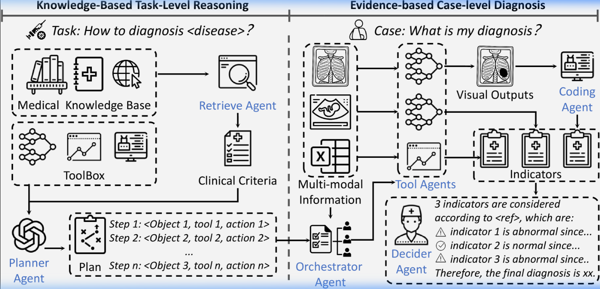

## 🎯 Research Overview
- **Problem:** 多模态 VLM 直接给结论，缺乏基于证据的分步推理，导致可靠性不足。
- **Contribution:** 分层诊断工作流 — Disease-level (指南 RAG) → Patient-level (个体化工具调用) → 逐步验证。
- **Impact:** ICLR 2025; 在多种解剖区域、成像模态和疾病类型上超越主流 VLM 和专家模型。

## 🔬 Architecture (分层推理)

### Layer 1: Disease-level (标准化计划生成)
- RAG Agent 检索医学指南
- 生成基于临床标准的调查提纲/逻辑树
- **对我们的价值**: 用 NCCN 胰腺癌指南确定 R/BR/LA 分类标准

### Layer 2: Patient-level (个体化逐步推理)
- 调用专用视觉模型进行定量/定性评估
- 每步必须能溯源
- **对我们的价值**: 拿着 Layer 1 的客观标准，测量当前病人的影像

### Verification
- 每个推理步骤验证可靠性
- 确保证据导向的诊断
- **对我们的价值**: Layer 3 交叉核验 (指南标准 ↔ 影像实测)

## 🔗 Connections
- **迁移到:** [Pancreatic_Cancer Architecture] (RAG_MDT_Agent 分层架构)
- **arXiv:** https://arxiv.org/abs/2503.18968
- **GitHub:** https://github.com/jinlab-imvr/MedAgent-Pro

