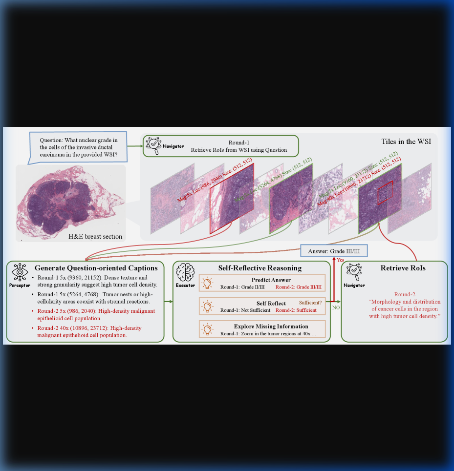

## 🎯 Research Overview
- **Problem:** WSI (全切片病理图像) 分析缺乏可解释的动态推理轨迹。
- **Contribution:** Training-free LLM Agent 框架，模拟病理医生 "放大→观察→反思" 的迭代诊断过程。
- **Impact:** 在 5 个数据集上展示强零样本迁移能力。

## 2. 系统核心模块解构 (Architecture Deconstruction)

### Navigator (导航者)
- 控制视角，自主探索 WSI 空间
- 迭代且精确地框出微观 ROI
- **对我们的价值**: CT volume Z 轴巡航 = WSI XY 巡航; MPR_Controller = Navigator

### Perceptor (感知者)
- 多尺度视觉特征提取器
- 从 Navigator 定位的区域提取形态学视觉线索

### Executor (执行者)
- 持续演进的自然语言推理引擎
- 将 Navigator+Perceptor 的线索串成 Chain-of-Thought

## Key Properties
- **Training-free**: 不需要额外训练，直接使用 LLM
- **Zero-shot generalization**: 跨数据集泛化
- **Reflective loop**: 支持反思循环 (重走某条路径)
- **人类病理专家协同评估**: 确认临床可用性

## 🔗 Connections
- **迁移到:** [Pancreatic_Cancer Architecture] (MPR_Controller 巡航模式)
- **arXiv:** https://arxiv.org/abs/2511.17052
- **GitHub:** https://github.com/G14nTDo4/PathAgent

